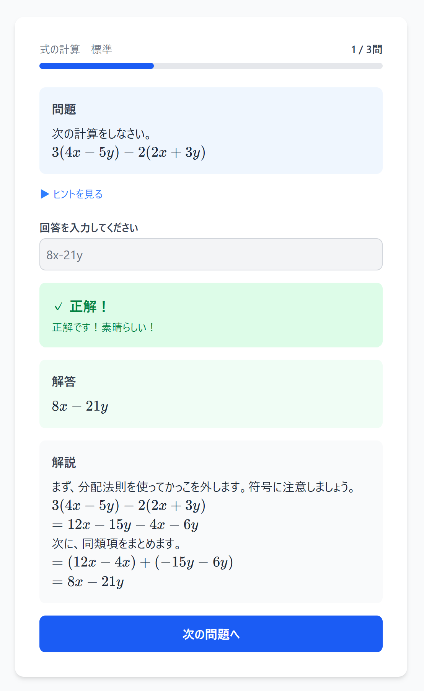
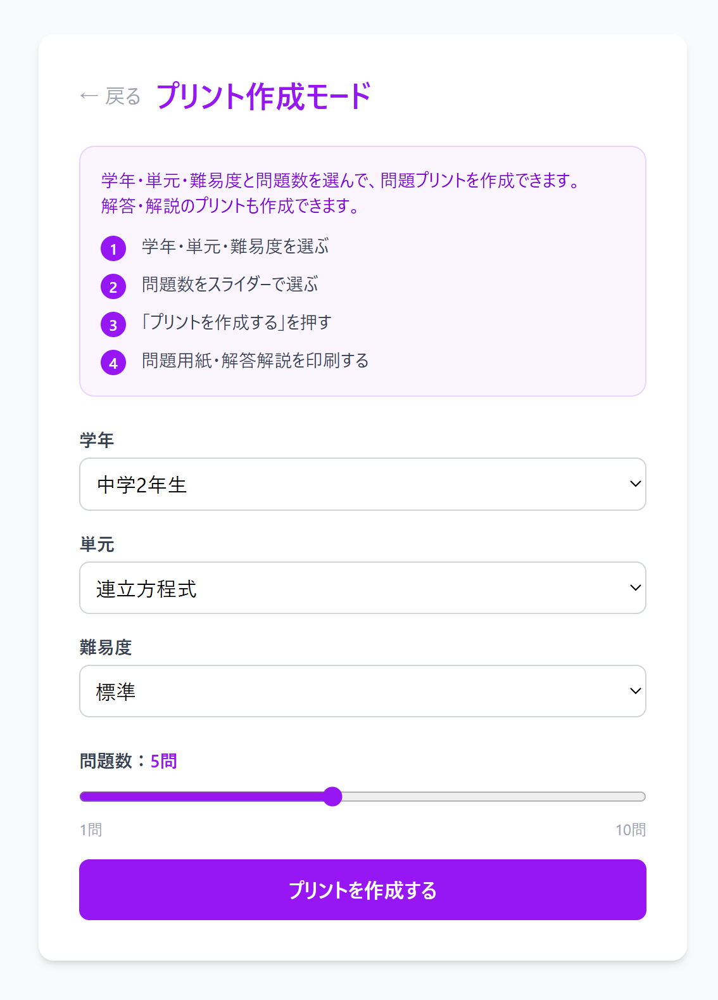
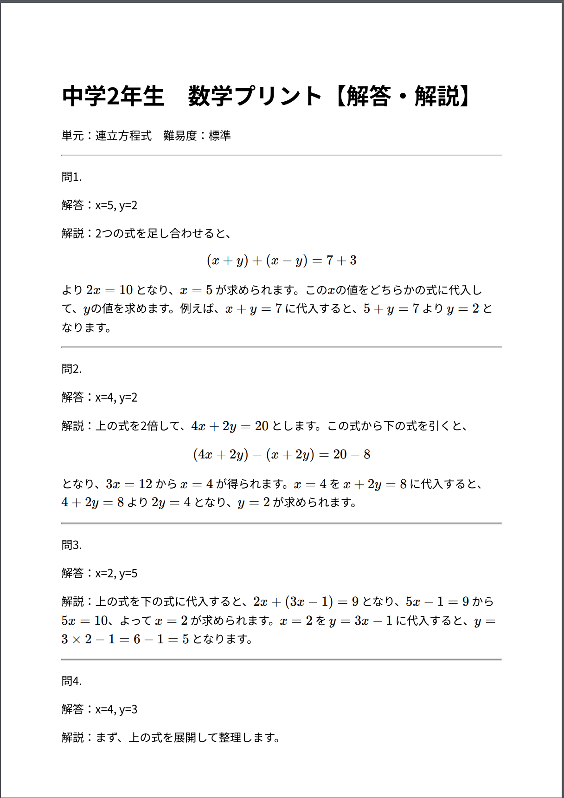
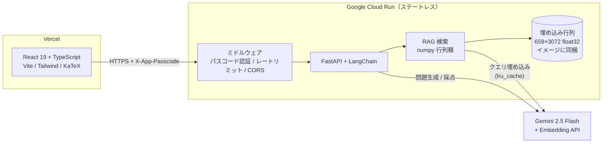

# 数学問題生成アプリ

中学生向けの数学**計算問題**を生成AIで自動生成・採点・解説するWebアプリ。
個別指導塾の講師が、生徒の苦手に合わせた演習プリントを**1分で用意する**ためのツールです。

**🔗 デモ: https://math-app-chi-eight.vercel.app**


---

## 解決している課題

個別指導塾の講師が、生徒の苦手に合わせた演習プリントを宿題として渡したい。
しかし実際には「問題集の選定 → 該当問題の選定 → 印刷」の3工程を、**授業と授業の間の10分の休み時間**でこなす必要があります。結果として生徒を待たせてしまう。

このアプリは、学年・単元・難易度・問題数を選ぶだけで、**問題用紙と解答解説用紙をその場で生成**します。準備時間をほぼゼロにするのが目的です。

生成内容は**文部科学省の学習指導要領解説を参照**しているため、その学年でまだ習っていない範囲の問題が出にくくなっています。

> 図形の描写やグラフの読み取りを必要とする問題は対象外。**計算問題に特化**しています。

---

## デモ

### 演習モード

問題を1問ずつ出題し、回答を入力すると即座に採点します。解答と解説も表示されます。



### プリント作成モード

学年・単元・難易度・問題数を選んで生成します。



生成されるのは**問題用紙**と**解答・解説用紙**の2種類。そのまま印刷・PDF保存できます。

| 問題用紙 | 解答・解説用紙 |
|---|---|
|  |  |

数式はすべて LaTeX で受け渡し、KaTeX でレンダリングしています。連立方程式の `\begin{cases}` のような複雑な構造も崩れずに印刷できます。

---

## 対象単元

| 学年 | 単元 |
|------|------|
| 中学1年生 | 正負の数、文字と式、方程式 |
| 中学2年生 | 式の計算、連立方程式 |
| 中学3年生 | 式の展開、因数分解、平方根、二次方程式 |

単元マスタは `frontend/src/mathUnits.ts` が正。

---

## アーキテクチャ



**バックエンドは永続ディスクを持ちません。** 検索インデックスをビルド時に固めてイメージに同梱しているため、ゼロスケールするサーバーレス環境にそのまま載ります。

### 技術スタック

| 領域 | 使用技術 |
|------|---------|
| バックエンド | FastAPI / LangChain（LCEL）/ Gemini 2.5 Flash / NumPy / uv |
| フロントエンド | React 19 / TypeScript / Vite / Tailwind CSS v4 / KaTeX / React Router |
| インフラ | Cloud Run / Vercel / Artifact Registry / Secret Manager / GitHub Actions |

---

## 技術的な工夫と意思決定

### 1. ベクトルDBをやめて numpy に置き換えた

当初は ChromaDB で RAG を構築していましたが、**`persist_directory` が永続ディスクを要求するためデプロイ先が EC2 に固定され**、t3.micro（1GB）ではメモリ不足で動作が不安定でした。

対象文書は学習指導要領解説の**1本だけで659チャンク**。この規模にベクトルDBは過剰だと判断し、埋め込みを事前計算してリポジトリに同梱し、実行時は numpy の行列積1回で検索する構成に変えました。構築時に L2 正規化しておけば、検索は `vectors @ query` だけでコサイン類似度になります。

**主目的はメモリ削減ではなく、状態を持たない設計にしてデプロイ先の選択肢を取り戻すこと**でした。結果として Cloud Run に移行できています。

| 指標 | 変更前 | 変更後 |
|------|--------|--------|
| イメージサイズ | 1.75 GB | **644 MB** |
| 依存パッケージ数 | 135 | **67** |
| メモリ（リクエスト後） | 230 MiB | **194 MiB** |
| 検索レイテンシ（同一クエリ2回目） | 0.503 s | **5.1 ms** |

2回目以降が劇的に速いのは、クエリ埋め込みに `lru_cache` を効かせたためです。旧実装はリクエストごとに embeddings オブジェクトを作り直しており、キャッシュが効く余地がありませんでした。

> 判断の経緯と検証の詳細は [`docs/refactoring-rag.md`](docs/refactoring-rag.md) に記録しています。

### 2. 置き換え前にベースラインを取って回帰を検証した

検索エンジンを差し替えると品質劣化に気づきにくいため、**ChromaDB を削除する前に**全9クエリ（学年×単元）の上位3件を本文・スコアごとスナップショットしました（[`backend/tests/fixtures/retrieval_baseline.json`](backend/tests/fixtures/retrieval_baseline.json)）。

numpy 実装で同じクエリを引いた結果、**順位まで含めて 27/27（100%）が一致**。チャンク数も659で完全一致し、テキスト抽出ライブラリの変更（PyPDFLoader → pypdf）による差異もないことを確認しました。

### 3. ハイブリッド採点でLLM呼び出しを減らした

採点は、まず正規化した文字列一致を試し、一致すれば**LLMを呼ばずに即正解**とします。不一致のときだけ Gemini にフォールバックする方式です。

正規化では `$` の除去、`\frac{a}{b}` → `a/b`、LaTeXコマンド除去、全角→半角、空白除去を行います。`8x-21y` と `8x - 21y` のような表記ゆれで不正解にしないための処理です。

### 4. LaTeX と JSON のエスケープを3層で防御

数式を LaTeX 文字列として JSON でやり取りすると、バックスラッシュが壊れやすい問題があります。プロンプト側（2重出力を指示）、バックエンド側（パーサ前段で `\f`+`rac` のような制御文字化を復元）、フロント側（`$`/`$$` で分割してレンダリング）の3箇所で防いでいます。

### 5. 公開デモの事故防止

バックエンドを公開すると API キーを誰でも消費できてしまうため、多層で歯止めをかけています。

- **共有パスコード** — フロントのビルドに埋め込むので**訪問者の入力は不要**。API の直叩きだけを弾く
- **レートリミット** — IPごと・インメモリ。`X-Forwarded-For` の左端から実クライアントIPを取る（Cloud Run はプロキシ経由のため）
- **`--max-instances 3`** — 最終的なコスト上限として機能させる
- 予算アラート

セキュリティ機構ではなく**事故防止**が目的だと割り切っています。

なお **CORS は最外側のミドルウェアとして登録**する必要があります。Starlette は最後に追加したものが最も外側になるため、順序を誤ると401/429のレスポンスにCORSヘッダが付かず、ブラウザ側では原因不明の「CORSエラー」になります。

### 6. リファクタ中に見つけたログ消失の不具合

作業中に、**uvicorn が root logger を設定しないため `app.*` のログが1行も出力されていない**ことに気づきました。影響は検索結果が見えないことだけでなく、**インデックス読み込み失敗のエラーログも消えていた**点です。つまり指導要領を参照できないまま問題を生成し続けても気づけない状態でした。「指導要領準拠」が売りのアプリとして看過できないため修正しています。

---

## セットアップ

Docker Compose で起動します。**検索インデックスは同梱済みなので、事前のベクトル化は不要**です。

```bash
git clone https://github.com/takahiro44/Math-App.git
cd Math-App
cp .env.example .env      # GOOGLE_API_KEY を設定
docker compose up --build -d
```

| サービス | URL |
|---------|-----|
| フロントエンド | http://localhost:5173 |
| バックエンド | http://localhost:8000 |
| API ドキュメント | http://localhost:8000/docs |

環境変数の一覧は [`.env.example`](.env.example) / [`frontend/.env.example`](frontend/.env.example) に記載しています。

### APIエンドポイント

| メソッド | パス | 説明 |
|---------|------|------|
| GET | `/health` | ヘルスチェック（認証・レートリミット免除） |
| POST | `/question/generate` | 問題を1問生成 |
| POST | `/print/generate` | 複数問をまとめて生成 |
| POST | `/grading/grade` | 回答を採点 |

### デプロイ

フロントエンドは Vercel、バックエンドは Cloud Run。手順は [`docs/deploy.md`](docs/deploy.md) にまとめています。

### 検索インデックスの再構築

指導要領PDFを差し替えたときだけ実行します。

```bash
cd backend
uv run --group build python scripts/build_index.py
```

pypdf でテキスト抽出 → 500字/オーバーラップ50 でチャンク化 → Gemini で埋め込み → L2正規化して `backend/app/rag/data/` に出力します。埋め込みAPIのレート制限で中断してもチェックポイントから再開されます。

---

## 出典

出典：「【数学編】中学校学習指導要領（平成29年告示）解説」（文部科学省）
https://www.mext.go.jp/component/a_menu/education/micro_detail/__icsFiles/afieldfile/2019/03/18/1387018_004.pdf
（2026年7月25日に利用）

本コンテンツは文部科学省ウェブサイト利用規約（政府標準利用規約第2.0版準拠、CC BY 4.0互換）に基づき利用しています。

## ライセンス

適用範囲がファイルによって異なります。

| 対象 | ライセンス |
|------|-----------|
| ソースコード（下記データを除くリポジトリ全体） | **MIT** — [LICENSE](LICENSE) |
| `backend/app/rag/data/guidelines_chunks.json`<br>`backend/app/rag/data/guidelines_vectors.npz` | **文部科学省ウェブサイト利用規約**（政府標準利用規約第2.0版準拠、CC BY 4.0互換）に基づき利用。**出典表示が必要** |

`backend/app/rag/data/` のデータは学習指導要領解説から機械的に抽出したもので、このリポジトリの著作物ではありません。詳細は [`backend/app/rag/data/README.md`](backend/app/rag/data/README.md) に記載しています。
